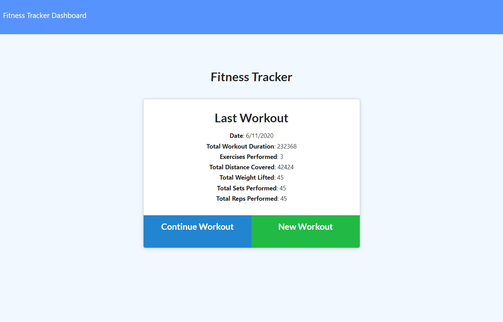
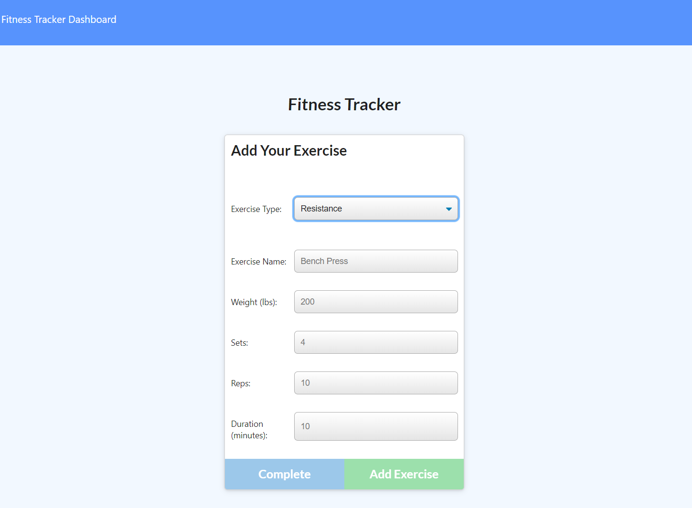
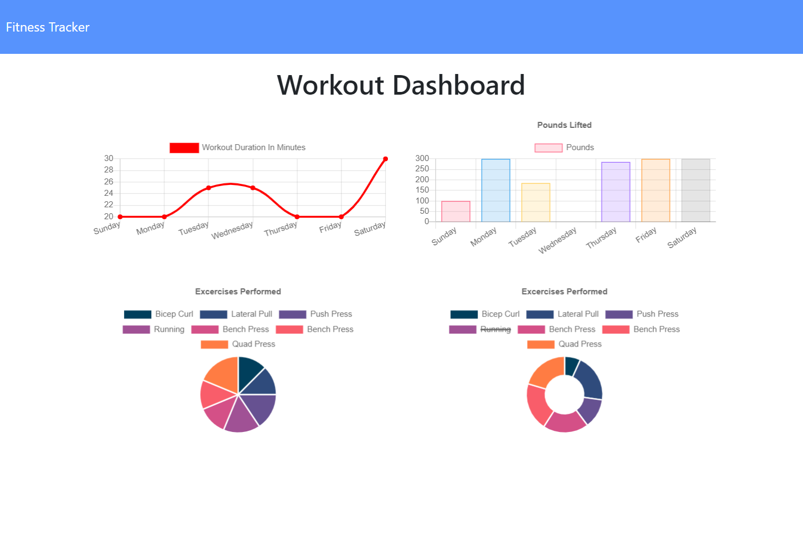

# Assignment 13: Fitness Tracker

## Web app to track workouts and visualize weekly exercise patterns, built using Mongoose and Node

Home page displys statistics of the previous workout: the user can continue that workout or create a new one.

Users can add two types of exercise: cardio or resistance. Each type of exercise has different properties that the user can enter.

The user has access to a dashboard which displays the statistics of the last week of exercise.

## Live site: https://immense-atoll-66797.herokuapp.com/
